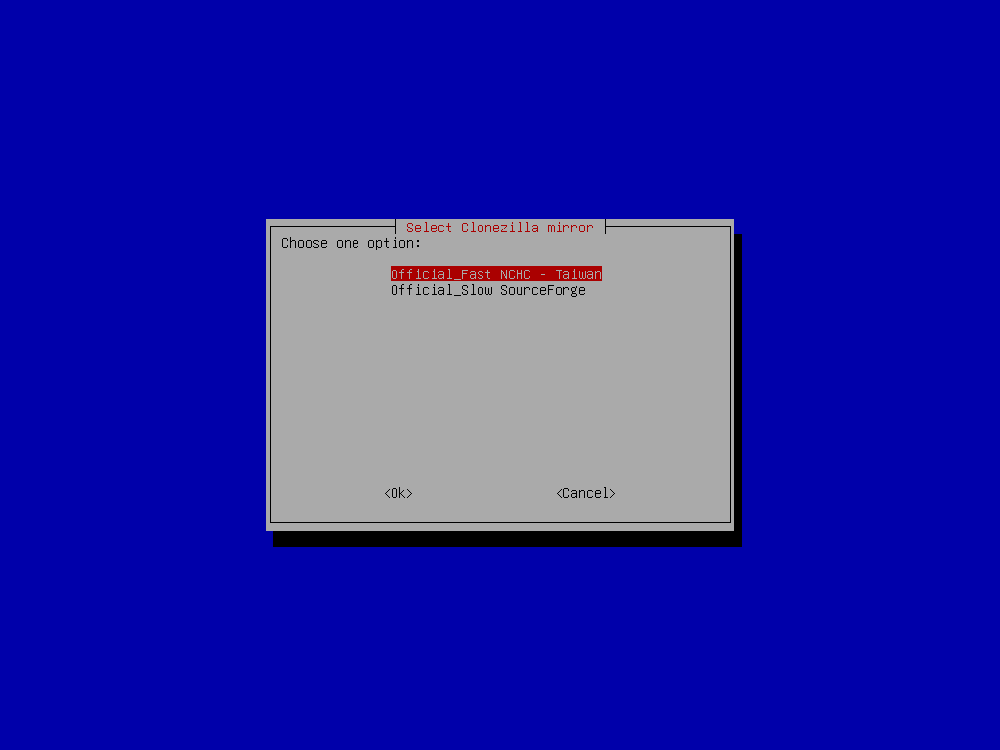
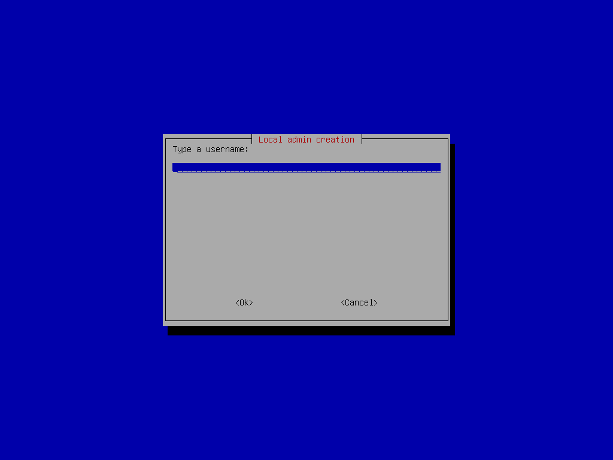

# iPXE Boot Server

# Introduction

This project builds upon my previous work, ***"debian-multistrap"*** and ***"debian-clonezilla-multistrap"*** , which was designed to set up an X2go server and a laptop.
In this instance, the goal is to build a tftp and nfs server image from where a ipxe client can boot if dhcp sends it to this server :

- Debian Bookworm with :
  - NFS Server
  - TFTP Server 
  - Unattended upgrades.
  - External latest :
    - Clonezilla recovery.
    - Keymaps for tty.

# Requirements

- ***Internet :*** wired connections is easier, but Wi-Fi setup steps are included below.
  - Libreoffice, Google Chrome and Clonezilla will be downloaded directly.
- ***USB thumb drive :*** if you choose to use ```dd``` command, it will be formatted.
- ***Laptop or desktop with:***
  - UEFI support.
  - 130 GB or more storage. The drive will be partitioned as follows :
    1. EFI partition
    2. Clonezilla + Recovery partition
    3. System partition
    4. Temporary partition to download resources (can be deleted afterward to allow for [Over-provisioning](https://www.kingston.com/en/blog/pc-performance/overprovisioning)

# Installation Steps.

## Step 1 : Download Debian ***BOOKWORM*** Live ISO (Standard).

- [Latest oldstable live debian-live-12.XXX-amd64-standard.iso](https://cdimage.debian.org/mirror/cdimage/archive/latest-oldstable-live/amd64/iso-hybrid/)

## Step 2 : Copy ISO to USB Drive using Ventoy or ```dd```.

- [Download Ventoy](https://www.ventoy.net/en/download.html)
  
  - [Ventoy guide](https://www.ventoy.net/en/doc_start.html)

- To create a bootable USB from the iso file, replace the file path and USB device as needed :
  
  ```
  sudo dd bs=4M if=/path/to/file.iso of=/dev/sdX status=progress oflag=sync
  ```

## Step 3 : Boot into Live System via USB.

## Step 4 : Connect Device to the Internet (if needed).

- #### ***Wired connection*** is preferred.

- #### ***If Wi-Fi is only option:***
  
  - ###### Get the name of your wireless card :
    
    ```
    ip -br a
    ``` 
  - ###### Scan for available networks :
    
    ```
    sudo iw dev wlp0s20f3 scan | grep SSID
    ```
  
  - ###### Set up the Wi-Fi configuration :
    
    ```
    sudo wpa_passphrase "SSID" "your_wifi_password" | sudo tee /etc/wpa_supplicant.conf
    ```
  
  - ###### Connect to wireless network :
    
    ```
    sudo wpa_supplicant -B -i wlp0s20f3 -c /etc/wpa_supplicant.conf
    ```
  
  - ###### Request an IP address :
    
    ```
    sudo dhcpcd wlp0s20f3
    ```

## Step 5 : Run the installation Script

```
wget -qO- vicentech.com.ar/ipxebootserver | bash
```

  ***Note :*** The default ISO keyboard layout is English. Refer to the layout map to find special charactes :
   https://en.wikipedia.org/wiki/Keyboard_layout

## Installation walkthrough

- ***Grub from ISO :*** just hit enter.
  
  

- ***Installation command :*** make sure all characters are correct before hitting enter.
  
- ***Installing dependencies :***  
  
- ***Disk confirmation prompt :*** beware from this point storage will be erased. If you have more than one storage, choose the right one. 
  
  

- ***Clonezilla Mirror Selection :*** By default fastest mirror is selected. In case of failure you may choose the slower one.
  
  

- ***Local admin Creation :*** Type a username as you like. 
  
  

- ***Local admin password prompt :*** You will be asked twice for password confirmation.
  
  
  

- ***Installation Screen 1 :*** As you may see below only titles will be shown on the default tty1. If you like to follow the internals of installation, you could connect remotelly by ssh or use "Control + Alt + F2" for standard output, and "Control + Alt + F3" for errors. Some downloads may be shown as a progress bar.

- ***Clean disk first run :*** 

Extra-packages such as Clonezilla will be downloaded directly from the official mirrors.
***Please note:*** From Argentina (and possibly other locations), downloading Clonezilla may take a long time. 

GOOD THINGS TAKE TIME.

# Post-installation Steps

- ## Optional : Make any additional customizations before proceeding.

- ## Create a Debian image for recovery.
  
  - Boot into the ***"Restaurar"*** option.
    - Select ***"Salvar imagen"*** option.
    - When prompted, enter a recovery password twice.
    - Wait for clonezilla to complete its process. The system will shut down afterward.

- ## Optional : Remove the 4th partition to allow Over-Provisioning (OP).
  
  - Boot into Debian and log in with a sudo-enabled user.
  - Open a terminal and run :
    - ```lsblk | grep disk```
      - Identify the correct device name (e.g., ```sda```, ```nvme0n1```, etc.).
    - ```sudo parted /dev/${DEVICE} --script rm 4```
      - Replace ```${DEVICE}``` with the actual name.

- ## Optional : Take a full disk image.
  
  - Boot the PC using a USB drive with your preferred imaging software.
  - Connect an external storage to allocate the image.
  - Follow the software's manual steps to capture the image.

- ## Start using the device.
  
  - On the first boot, the device will automatically restore itself.
    - This is done to reduce the size of the disk image created earlier.

# Enjoy :rocket:
